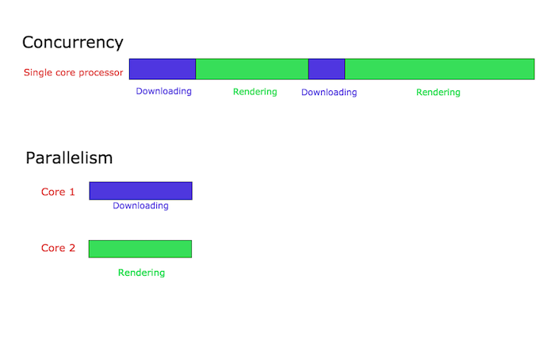

# Introduction to Concurrency

Go is a concurrent language and not a parallel one.
Before discussing how concurrency is taken care in Go, we must first understand what is concurrency and how it is different from parallelism.

## What is concurrency?

Concurrency is the capability to deal with lots of things at once. It’s best explained with an example.

Let’s consider a person jogging.
During his morning jog, let’s say his shoelaces become untied.
Now the person stops running, ties his shoelaces and then starts running again.
This is a classic example of concurrency.
The person is capable of handling both running and tying shoelaces,
that is the person is able to deal with lots of things at once :)

Parallelism is doing lots of things at the same time.
It might sound similar to concurrency but it’s actually different.
Let’s understand it better with the same jogging example.
In this case, let’s assume that the person is jogging and also listening to music on his iPod.
In this case, the person is jogging and listening to music at the same time,
that is he is doing lots of things at the same time.
This is called parallelism.

---

### Note

Concurrency in a Restaurant:
Imagine a restaurant with a single chef in the kitchen.
Although the chef can only work on one dish at a time, they can switch between multiple orders concurrently.
The chef might start cooking a steak, then move on to chopping vegetables for a salad while the steak is cooking, and then return to flip the steak.
In this way, the chef is handling multiple tasks concurrently, switching between them as needed.

Parallelism in a Restaurant:
Now, consider a restaurant with multiple chefs working in the kitchen.
Each chef can work on a separate dish simultaneously, allowing multiple orders to be prepared in parallel.
One chef might be grilling steaks, another might be preparing pasta dishes, and a third might be assembling salads – all happening simultaneously.
This parallel execution of tasks allows the restaurant to serve more customers faster, leveraging the combined efforts of multiple workers.

In both scenarios, the restaurant represents a system, and the orders represent tasks or processes that need to be executed.

Concurrency is like having a single chef who can switch between multiple orders, handling them one at a time but giving the illusion of simultaneous progress.

Parallelism is like having multiple chefs working together, each handling a separate order at the same time, resulting in true simultaneous execution of tasks.

The key difference lies in the number of workers (chefs) available and their ability to execute tasks simultaneously or by switching between them.

---

## Concurrency and Parallelism - A technical point of view

We understood what is concurrency and how it is different from parallelism using real world examples.
Now let’s look at them from a more technical point of view as we are geeks :).

Let’s say we are programming a web browser. The web browser has various components.
Two of them are the web page rendering area and the downloader for downloading files from the internet.
Let’s assume that we have structured our browser’s code in such a way that each of these components can be executed independently (This is done using threads in languages such as Java and in Go we can achieve this using Goroutines, more on this later). When this browser is run in a single-core processor, the processor will context switch between the two components of the browser. It might be downloading a file for some time and then it might switch to render the html of a user requested web page. This is known as concurrency. Concurrent processes start at different points of time and their execution cycles overlap. In this case, the downloading and the rendering start at different points in time and their executions overlap.

Let’s say the same browser is running on a multi-core processor. In this case, the file downloading component and the HTML rendering component might run simultaneously in different cores. This is known as parallelism.

Parallelism will not always result in faster execution times. This is because the components running in parallel have might have to communicate with each other. For example, in the case of our browser, when the file downloading is complete, this should be communicated to the user, say using a popup. This communication happens between the component responsible for downloading and the component responsible for rendering the user interface. This communication overhead is low in concurrent systems. In the case when components run in parallel in multiple cores, this communication overhead is high. Hence parallel programs do not always result in faster execution times!

## Support for concurrency in Go

Concurrency is an inherent part of the Go programming language. Concurrency is handled in Go using Goroutines and channels. We will discuss them in detail in the upcoming tutorials.

That’s it for introduction to concurrency.
