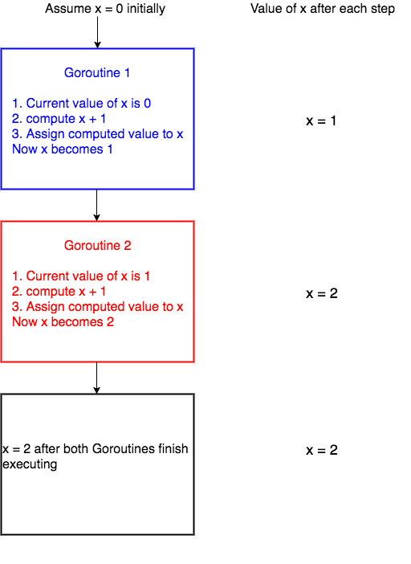

# Mutex

# Critical section

Before jumping to mutex, it is important to understand the concept of [critical section](https://en.wikipedia.org/wiki/Critical_section) in concurrent programming. When a program runs concurrently, the parts of code which modify shared resources should not be accessed by multiple Goroutines at the same time. This section of code that modifies shared resources is called critical section. For example, let’s assume that we have some piece of code that increments a variable x by 1.

```
x = x + 1
```

As long as the above piece of code is accessed by a single Goroutine, there shouldn’t be any problem.

Let’s see why this code will fail when there are multiple Goroutines running concurrently. For the sake of simplicity let’s assume that we have 2 Goroutines running the above line of code concurrently.

Internally the above line of code will be executed by the system in the following steps(there are more technical details involving registers, how addition works, and so on but for the sake of this tutorial lets assume that these are the three steps),

1. get the current value of x
2. compute x + 1
3. assign the computed value in step 2 to x

When these three steps are carried out by only one Goroutine, all is well.

Let’s discuss what happens when 2 Goroutines run this code concurrently. The picture below depicts one scenario of what could happen when two Goroutines access the line of code `x = x + 1` concurrently.


We have assumed the initial value of x to be 0. `Goroutine 1` gets the initial value of x, computes x + 1 and before it could assign the computed value to x, the system context switches to `Goroutine 2`. Now `Goroutine 2` gets the initial value of x which is still 0, computes x + 1. After this, the system context switches again to `Goroutine 1`. Now `Goroutine 1` assigns its computed value 1 to x and hence x becomes 1. Then `Goroutine 2` starts execution again and then assigns its computed value, which is again 1 to x and hence x is 1 after both Goroutines execute.

Now let’s see a different scenario of what could happen.



In the above scenario, `Goroutine 1` starts execution and finishes all its three steps and hence the value of x becomes 1. Then `Goroutine 2` starts execution. Now the value of x is 1 and when `Goroutine 2` finishes execution, the value of x is 2.

So from the two cases, you can see that the final value of x is 1 or 2 depending on how context switching happens. This type of undesirable situation where the output of the program depends on the sequence of execution of Goroutines is called race condition.

In the above scenario, the race condition could have been avoided if only one Goroutine was allowed to access the critical section of the code at any point in time. This is made possible by using Mutex.

## Mutex

A `Mutex` is used to provide a locking mechanism to ensure that only one Goroutine is running the critical section of code at any point in time to prevent race conditions from happening.

`Mutex` is available in the `sync` package. There are two methods defined on `Mutex` namely `Lock` and `Unlock`. Any code that is present between a call to `Lock` and `Unlock` will be executed by only one Goroutine, thus avoiding race condition.

```go
mutex.Lock()
x = x + 1
mutex.Unlock()
```

In the above code, `x = x + 1` will be executed by only one Goroutine at any point in time thus preventing race condition.

**If one Goroutine already holds the lock and if a new Goroutine is trying to acquire a lock, the new Goroutine will be blocked until the mutex is unlocked.**

## Program with a race condition

```go
package main
import (
	"fmt"
	"sync"
	)
var x  = 0

func increment(wg *sync.WaitGroup) {
	x = x + 1
	wg.Done()
}

func main() {
	var w sync.WaitGroup
	for i := 0; i < 1000; i++ {
		w.Add(1)
		go increment(&w)
	}
	w.Wait()
	fmt.Println("final value of x", x)
}

// final value of x (random number because not guaranteed)
```

In the program above, the `increment` function in line no. 7 increments the value of `x` by `1` and then calls `Done()` on the `WaitGroup` to notify its completion.

We spawn 1000 `increment` Goroutines from line no. 15 of the program above. Each of these Goroutines run concurrently and the race condition occurs when trying to increment x is line no. 8 as multiple Goroutines try to access the value of x concurrently.

Please run this program in your local as the playground is deterministic and the race condition will not occur in the playground. Run this program multiple times in your local machine and you can see that the output will be different for each time because of race condition. Some of the outputs which I encountered are `final value of x 941`, `final value of x 928`, `final value of x 922` and so on.

## Solving the race condition using a mutex

We can solve the race condition using channels too. Let’s see how this is done.

```go
package main

import (
	"fmt"
	"sync"
)

var x = 0

func increment(wg *sync.WaitGroup, m *sync.Mutex) {
	m.Lock()
	x = x + 1
	m.Unlock()
	wg.Done()
}

func main() {
	var w sync.WaitGroup
	var m sync.Mutex
	for i := 0; i < 1000; i++ {
		w.Add(1)
		go increment(&w, &m)
	}
	w.Wait()
	fmt.Println("final value of x", x)
}

// final value of x 1000
```

## Mutex vs Channels

We have solved the race condition problem using both mutexes and channels. So how do we decide what to use when? The answer lies in the problem you are trying to solve. If the problem you are trying to solve is a better fit for mutexes then go ahead and use a mutex. Do not hesitate to use mutex if needed. If the problem seems to be a better fit for channels, then use it.

Most Go newbies try to solve every concurrency problem using a channel as it is a cool feature of the language. This is wrong. The language gives us the option to either use Mutex or Channel and there is no wrong in choosing either.

In general use channels when Goroutines need to communicate with each other and mutexes when only one Goroutine should access the critical section of code.

In the case of the problem which we solved above, I would prefer to use mutex since this problem does not require any communication between the goroutines. Hence mutex would be a natural fit.

My advice would be to choose the tool for the problem and do not try to fit the problem for the tool.
